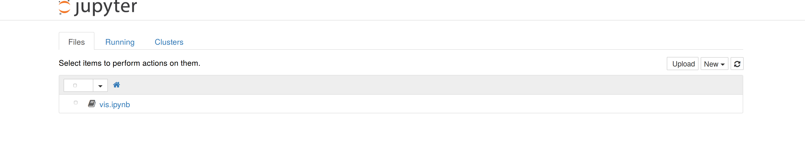
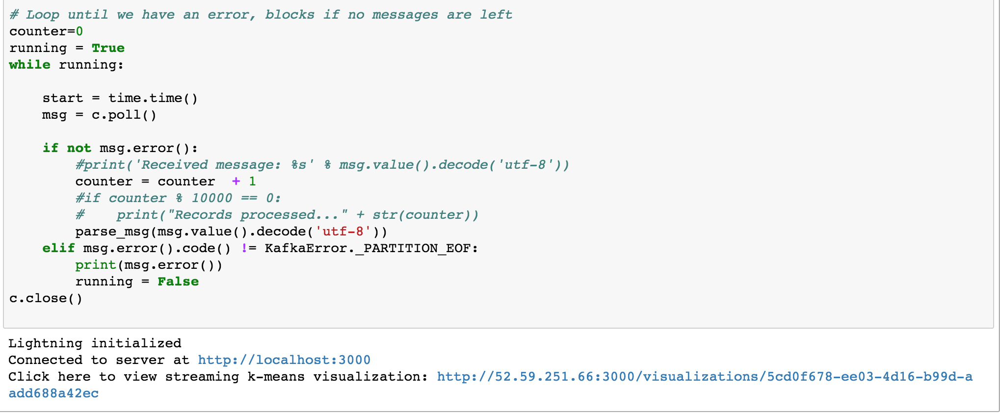
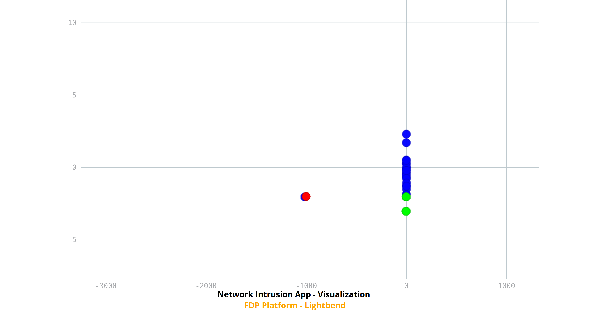

# FDP sample application for network intrusion detection

> **NOTE:** For a more complete version of these instructions, see the [online instructions](https://developer.lightbend.com/docs/fast-data-platform/0.1.0/user-guide/developing-apps/index.html#streaming-k-means).
>
This application runs under DC/OS and has the following components that form stages of a pipeline:

1. **Data Load from S3:** The first stage reads data from an S3 bucket and writes to a Kafka topic, passed as a command line argument. This stage is implemented with a set of `bash` scripts. See the `load-intrusion-data` directory.
2. **Data Transformation:** The second stage reads the data from the kafka topic populated in step 1, performs some transformations that will help in later stages of the data manipulation, and writes the transformed output into another Kafka topic. If there are any errors with specific records, these are recorded in a separate error Kafka topic. This stage is implemented as a Kafka Streams application. See the `transform-intrusion-data` directory.
3. **Online Analytics and ML:** This stage of the pipeline reads data from the Kafka topic populated by stage 2, sets up a streaming context in Spark, and uses it to do streaming K-means clustering to detect network intrusion. A challenge is to determine the optimal value for K in a streaming context, i.e., by training the model, then testing with a different set of data. (More on this below.)
4. **An implementation of batch k-means:** Using this application, the user can iterate on the number of clusters (`k`) that should be used for the online anomaly detection part. The application accepts a batch duration and for all data that it receives in that duration it runs k-means clustering in batch for all values of `k` that fall within the range as specified by the user. The user can specify the starting and ending values of `k` and the increment step size as command line arguments and the application will run k-means for the entire range and report the cluster score (mean squared error). The optimal value of `k` can then be found using the elbow method.

In addition to the pipeline components, we have two more.

4. **Visualization:** The output clusters can be visualized using any suitable visualization library.
We provide a visualization app as it is described at the related section.
5. **OpsClarity Integration for Monitoring:** The installation script of the cluster installs all "batteries" including Kafka, Spark and OpsClarity. Once the application runs, it can be monitored in OpsClarity.

## Prerequisites

In order to deploy and run the sample application, the following prerequisites have to be met:

1. Mac OS X or Linux host. The scripts for this application require `bash`, related *NIX tools, and Docker. Although these tools are available on Windows through various options, running this application on Windows has not been tested.
2. An FDP DC/OS cluster is up and running.
3. The DC/OS CLI is installed and authenticated on the machine where you intend to run the scripts that install and run this application, either locally or on the "bootstrap" node of the cluster. The FDP installer installs the CLI on the bootstrap node by default. See the section in the Installation Guide on [installing the DC/OS CLI](http://developer.lightbend.com/docs/fast-data-platform/latest/installation/index.html#install-dcos-cli-on-your-local-computer) for more information.
5. An AWS-installed FDP cluster is required. You'll also need the `$HOME/.ssh/aws.sh` file that was created during the installation, which contains required AWS and EC2 environment variables.
6. Appropriate ports (3000, 8888) must be open on the relevant instances on EC2 to access the visualization components from a client machine. This can be done by changing the inbounds rules of the FDP cluster's security group.

We'll discuss these requirements in more detail as we proceed.

## Data for the application

The application uses the dataset from [KDD Cup 1999](https://kdd.ics.uci.edu/databases/kddcup99/kddcup99.html), which asked competitors to develop a network intrusion detector. The reason for using this data set is that it makes a good case study for clustering and intrusion detection is a common use for streaming platforms like FDP.

## Installing the application

Start by using the `bin` scripts. Using the default options and assuming the DC/OS CLI is on your local machine, run these commands:

```bash
cd bin
./app-install.sh # Install and run the application components.
```

Try the `--help` option for `app-install.sh` for command-line options.

The script `app-install.sh` takes all configuration parameters from a properties file.  The default file is `app-install.properties` which resides in the same directory, but you can specify the file with the `--config-file` argument.  It is recommended that you keep a set of configuration files for personal development, testing, and production.  Simply copy the default file over and modify as needed.

```
## docker username in docker hub from where to download artifacts
docker-username=<docker hub user id>

## dcos kafka package - valid values : kafka | confluent-kafka
kafka-dcos-package=kafka

## whether to skip creation of kafka topics - valid values : true | false
skip-create-topics=false

## whether to use iam roles - valid values : true | false
with-iam-role=false

## kafka topic partition : default 1
kafka-topic-partitions=1

## kafka topic replication factor : default 1
kafka-topic-replication-factor=1

## S3 bucket to use to get Spark job artifacts
spark-job-s3-bucket=http://fdp-kdd-network-intrusion.s3.amazonaws.com
```

There is also an `bin/app-package.sh` script that creates a tar file `nwin-app.tar` in the project `bin` directory, which you can use to deploy this app to any cluster. If you aren't using the DC/OS CLI on your local machine, just run this command, then copy and unzip the jar file on any system with the DC/OS CLI installed on it. Then run the `app-install.sh` script from there.

#### Troubleshooting Tips

For problems related to DC/OS commands, see the [Troubleshooting](http://developer.lightbend.com/docs/fast-data-platform/latest/user-guide/troubleshooting/index.html) section of the [User Guide](http://developer.lightbend.com/docs/fast-data-platform/latest/user-guide/index.html).

### Installation Steps that Were Performed

The deployment of the sample application performed the following steps:

1. Deployed the Kafka Streams based ingestion module (Step 2 above) as a DC/OS package.
2. Deployed the Spark Streaming based analytics component (Step 3 above) as a Spark job.
3. Set up the data loading component so that we have data being loaded into Kafka topic from S3 buckets.

### Removing the app

Just run `./app-remove.sh`.

It also has a `--help` option to show available command-line options. For example, use `--skip-delete-topics` if your cluster does not support deleting topics.

## Building the App

If you want to build your own version and upload it to your own docker account, you'll use the `build-app.sh` script. It will stage build artifacts in an S3 bucket, which you'll need to create. In order to do this, `build-app.sh` will need to source your `$HOME/.ssh/aws.sh` to get information about your AWS account. Recall that this file was created when you installed the cluster.

You'll also need a [Docker Hub](https://hub.docker.com/) account, where the application Docker image will be uploaded.

Next, change to the `source` directory:
```
cd source
```

To see the options for specifying the S3 bucket and the Docker Hub user name and password, run the build script with the help option:
```
./build-app.sh --help
```

For frequent builds or to avoid showing your Docker Hub password on the command line, we recommend using an "options file". Create a file like the following, for example `./options.sh`:
```
DOCKER_USERNAME=myusername
DOCKER_PASSWORD=mypassword
S3_BUCKET=mys3bucket
```

Then invoke the build as follows:
```
./build-app.sh --options-file ./options.sh
```

Or, to specify each option explicitly on the command line:
```
./build-app.sh --docker-username name --docker-password pwd --s3-bucket name
```

The script builds all artifacts and pushes them to the appropriate repositories. The jars are pushed to S3. Use `build-app.sh --help` to view the available options. If you want to build an individual docker image then
you can run the corresponding `build-image.sh` script under the specific component's folder in source/docker.

> **NOTE:** The script will also install the AWS CLI, SBT, and Python tools, if required.

## Output of Running the App

### Anomaly Detection

Anomaly detection application writes the output as a delimiter separated file in the Kafka topic `nwcls`. The format of the data written is as follows:

For every microbatch, the output starts with a record containing all the cluster centroids. It is of the following format and will only be present as the first record for a microbatch being processed:

`Centroids:/<cluster centroid 1>/<cluster centroid 2>/...`

Here <cluster centroid i> refers to a cluster centroid which is a vector of appropriate dimension. The cluster centroids are ordered based on the cluster number.

The record of cluster centroids is followed by each data point processed in the microbatch. Each of these records contain the following information, separated by comma (`,`):

1. Predicted cluster number
2. Nearest centroid of this data point
3. The distance to nearest centroid of this data point
4. Label
5. `true`, if this point is anomalous, `false`, otherwise
6. The data point itself, being a vector of appropriate dimension, as a comma delimited string

The format is as follows:

`<Predicted Cluster No>,<centroid>,<distance to centroid>,<label>,<if anomalous>,<vector>`.

Both the record of cluster centroids and the cluster details go to topic `nwcls`.

### Batch K-Means

The idea behind batch k-means is to use it as a tool to fine tune the clustering process of anomaly detection. In other words, running `BatchKMeans` will give you an idea of what to pass as the value of `k` in the anomaly detection application (`SparkClustering`). Currently `BatchKMeans` iterates on the cluster number (`k`) range passed to it and prints the mean squared error for each of the values of `k` in the standard output. The optimal value an be detected using the elbow method.

## Visualization

[Jupyter](http://jupyter.org/) is used with a predefined notebook which can be run to draw cluster centroids and data with the help of the [lightning-viz](http://lightning-viz.org/) library. We bundle both in the same docker image. To access the visualization app, use the following steps.

### Get the Public IP Address

* Open the DC/OS UI and the _Services_ view.
* Click the app named `nwin-visualize-data`.
* Note the cluster-private IP address, e.g., `10.10.1.200`.
* In the directory where you ran the `fdp-installer`, run the script `bin/fdp-print-addresses.sh --both` to print both the public and private IP addresses of the cluster nodes. (You can also view the contents of the file `clusters/<my_cluster_name>/dcos.config`). Visually locate the public IP address corresponding to the private address.

You can also use the AWS Console to get the public IP address. Log into the AWS Console for your account, then open the EC2 dashboard. Either configure the view to show the private IP addresses in the table or click each entry until the _Description_ window below shows that you've found the node with the correct private IP address. Note the public IP address.

We'll use the name `public_ipv4_address` in the following steps.

### Access the Correct Ports and Start Jupyter Notebook

To access the Jupyter notebook, either expose the required ports or use `ssh` port tunneling.

To make the required ports public, 8888 and 3000, click _Security Groups_ in the AWS EC2 Dashboard and add two _inbound_ rules, both _Custom TCP Rules_ that allow access to ports 8888 and 3000 from any _Source_ connection `0.0.0.0:0`.

Then open `http://public_ipv4_address:8888` in a browser. Use the following password to login to the notebook: `lightbend123`

To use port tunneling instead, use the `bin/app-tunnel-visualizer.sh` command. You'll have to specify the `public_ipv4_address`:

```shell
bin/app-tunnel-visualizer.sh public_ipv4_address
```

It basically runs the following `ssh` command:

```shell
ssh -L 8888:localhost:8888 -L 3000:localhost:3000 -i /path/to/aws.pem.file ubuntu@public_ipv4_address
```

Then open http://localhost:8888 in a browser. Use the following password to login to the notebook: `lightbend123`

### Use the Notebook

In the browser, you'll see the following "home" page:



Click the `vis.ipnyb` notebook link to open it in a new browser tab. The first cell will be highlighted. Evaluate it by clicking the _Cell > Run Cells_ menu item or the _shift + enter_ keyboard shortcut.

The highlight will move to an empty cell. After a few seconds, you'll see text printed after the previous cell with code, as in the following image.



The URL is printed to access the visualization after data has started to flow from Kafka. Click the link labeled "Click here to view streaming k-means visualization". If it fails to load, it is probably because it uses the public IP address of the host and you chose to use port forwarding. Change the public IP address in the URL to `localhost`.

The visualization should look something like this:



Cluster centroids are shown in blue, while data points are shown in green and outliers in red. You can zoom in and zoom out to explore points of interest.

If you encounter problems, try re-starting the Jupyter kernel using the _Kernel_ menu.

## Access the Sample Apps from Zeppelin
Instead of deploying the sample apps using the procedure outlined above, you can also try them out in a notebook environment. FDP bundles a custom build of Apache Zeppelin that contains source code for these sample apps adapted to notebooks formats.

If you didn't already install Zeppelin, use the FDP installer command, `bin/fdp-start-base.sh --with-zeppelin`.

Then from under this project, run the following commands:
```bash
cd bin
./app-install.sh --use-zeppelin
```
Note the output of these commands. They will be useful later.

Then open Zeppelin UI from DC/OS. You should be able to see a folder "FDP Sample Apps" that contains two notebooks: SparkClustering and BatchKMeans. Open any one of them. If this is the first time you start Zeppelin, you will be prompted to save your interpreter settings. You can go with the default settings. Simply press the "Save" button. After you open a notebook, the first paragraph contains some information about the contents of the notebook. In the second paragraph, you will be asked to copy part of the output you obtained previously by running `app-install.sh` to the cell. Hit `Shift + Return` to run a paragraph when done. You are free to change the parameters in the notebook.

There are currently a few limitations with Zeppelin compared to running the sample apps by deploying them to DC/OS.
1. Only one Spark streaming context can be running at a time, meaning you cannot start streaming contexts in both SparkClustering and BatchKMeans notebooks.
2. Zeppelin does not support stopping a started streaming context that is still running. To test the other notebook after starting streaming context in one notebook, you need to restart Zeppelin service from the DC/OS UI.
